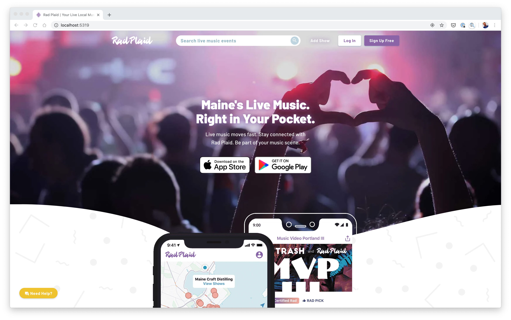
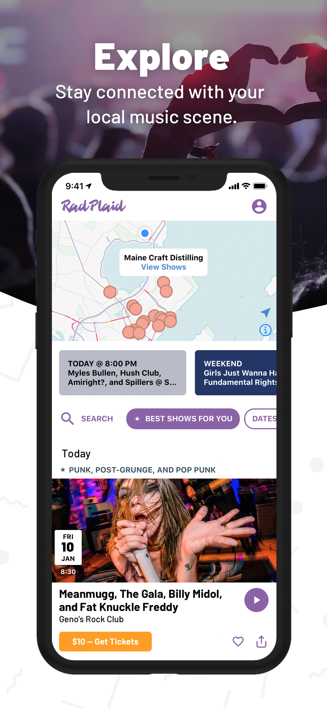

# Rad Plaid Server-Side React Code Sample

Rad Plaid was a project to increase the accessibility of live music events for local music communities.

# Dependencies

High-level libraries included in the project.

- React
- Redux
- Express
- SCSS
- Webpack
- Stripe
- Handlebars
- Howler
- Gulp

# Screenshots

[Homepage Video](screenshots/web/homepage.mov) | [Add Live Event](screenshots/web/addshow.mov) | [Sign Up Video](screenshots/web/signup.mov)

